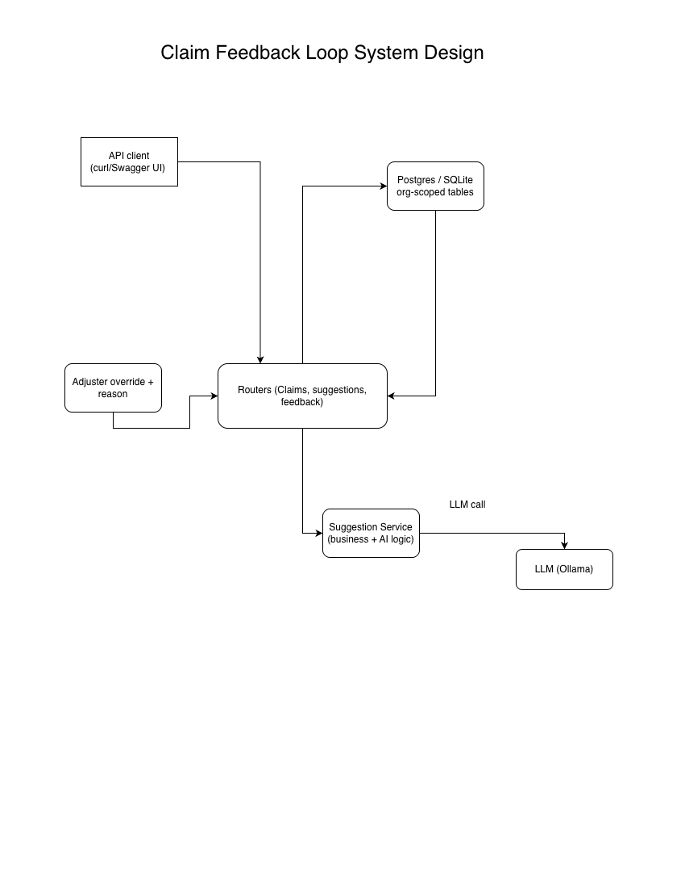

# Claims Feedback Loop

A multi-tenant claims API with a human-feedback-loop pattern: an AI suggests
the next action on a claim, a human adjuster (SME) accepts or overrides it,
and that decision is captured for later analysis.

This is deliberately scoped to run in minutes with **zero setup** (SQLite by
default).

## Why I Built This Project

I wanted hands-on practice with a pattern that's increasingly common in AI products: using a human expert's corrections as a live feedback signal, instead of treating "the model was wrong" as a dead end. In an insurance claims context specifically, an adjuster overriding an AI's suggested action is valuable data — it's a signal about what the model is missing — and a well-designed system should capture and reuse that signal, not just log it and move on.

I also wanted to practice this with the discipline a real B2B SaaS product needs: strict multi-tenant data isolation (every org's claims, adjusters, and feedback history stay scoped to that org), and a clear boundary between "HTTP plumbing" and "AI/business logic" so the AI piece can evolve independently without destabilizing the API layer around it.

## Design Decisions

- Service layer, not logic in the router. app/services/suggestion_service.py owns suggestion generation; app/routers/suggestions.py only parses the request, calls the service, and shapes the response. This keeps prompt construction, the LLM call, and (soon) retrieval of past feedback unit-testable on their own, with no FastAPI app or HTTP layer required to test them.

- Tenant scoping is enforced at the query level, everywhere. Every claim, adjuster, and feedback lookup is filtered by org_id — including a composite index on (org_id, status) for the common query pattern — rather than relying on an application-level check that's easy to forget on one endpoint and not another.

- An explicit claim state machine. Claims move through open → under_review → approved/denied via a transition table (app/models.py), and an invalid transition returns 409, not a silent no-op or a 500.

- The feedback loop is structural, not a log table. POST /suggestions/{id}/feedback requires an override_reason whenever an adjuster overrides a suggestion, and that reason is what Day 2's LLM integration will pull as few-shot context for similar future claims — the schema was designed around that reuse from the start, not bolted on later.

- Auth is explicitly stubbed, not faked as real. app/deps.py reads org identity from an X-Org-Id header with a comment flagging that this is a stand-in for JWT/session auth — honest about what's a placeholder versus what's production-shaped.

## Claims Feedback Loop System Design Diagram

## Future Improvements
- Real LLM call in suggestion_service.py, replacing the current rule-based stub — same function signature, so the router/API contract doesn't change.
- Few-shot context from past overrides: query recent Feedback rows scoped to the same org (and similar claim status) and include them in the prompt, so the model learns from this org's specific correction history.
- Structured-output validation: parse the LLM's response into a Pydantic model at the boundary (score/action bounds, required fields) instead of trusting raw JSON — LLM output treated like any other untrusted input.
- Lightweight RAG over claim history notes: a lightweight first version, with a clear path to real chunking/embeddings/vector search once the pattern is proven.
- Tests around tenant isolation and the state machine, so a future refactor can't silently reintroduce a cross-tenant leak.